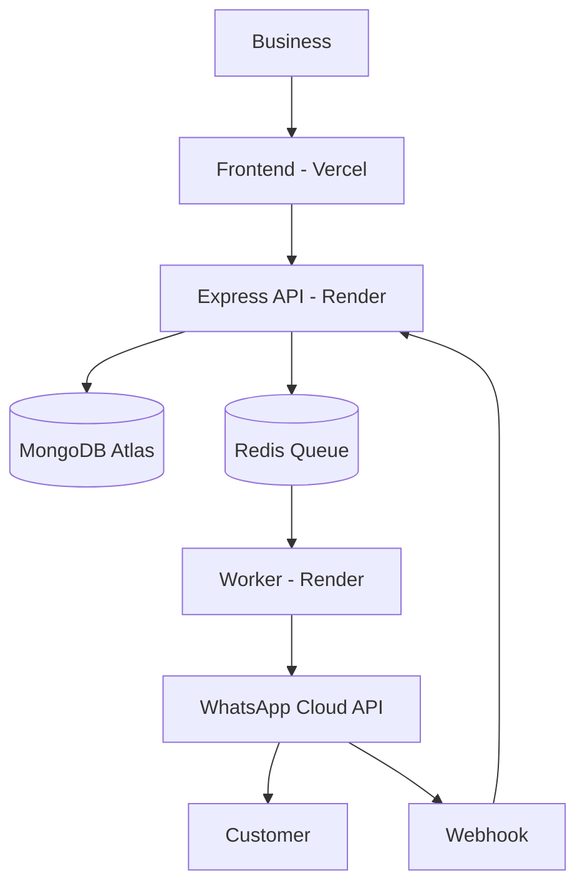

# Cymor Messaging

Cymor Messaging is a multi-tenant WhatsApp Business messaging platform that provides businesses with a unified dashboard and developers with an API for integrating WhatsApp communication into their applications.

Built by **Legendary Smiley Cymor** — *no one does it better than me.*

> **Build status:** All 19 phases from the original build order are implemented — architecture/config, auth + multi-tenant RBAC, Meta/WhatsApp Embedded Signup integration, the messaging engine + queues, idempotent webhooks (inbound + outbound), the shared realtime inbox, contacts, the public Developer API + API keys, templates, campaigns, automations, OTP, Cloudinary media, analytics/usage tracking, audit + API logs, the frontend (landing page, auth flow, and a dashboard shell covering the core workflows — see note below), automated tests for the highest-risk behaviors (multi-tenancy isolation, webhook idempotency, OTP, API keys), and deployment configs for Render + Vercel.
>
> **One honest scope note:** the dashboard ships with Overview, Inbox, Contacts, WhatsApp connection, and API Keys as fully working reference pages. The remaining sidebar pages listed in `docs/architecture.md` (Conversations, Templates, Campaigns, Automations, OTP, Webhooks, API Logs, Analytics, Media, Audit Logs, Team, Settings) are **not yet built as HTML pages** — their backend APIs are complete and tested, but the UI for them follows the exact same pattern as the pages that do exist (`assets/js/api.js` + `assets/js/sidebar.js` + a fetch-and-render loop). Building them out is mechanical repetition of that pattern, not new architecture.

## Architecture



```
Cymor Messaging
                       |
      +----------------+----------------+
      |                |                |
  Dashboard        Developer API     Webhooks
      |                |                |
      +----------------+----------------+
                       |
                Messaging Engine
                       |
                Queue / Workers
                       |
              WhatsApp Business API
                       |
                    Customers
```

Cymor is an application/infrastructure layer on top of the **official Meta WhatsApp Business Platform (Cloud API)**. It never uses unofficial WhatsApp Web automation, QR scraping, or browser session hijacking.

## Tech Stack

- **Frontend:** HTML5 / CSS3 / vanilla JS, mobile-first, deployed on Vercel
- **Backend:** Node.js + Express + TypeScript, deployed on Render (Web Service)
- **Worker:** Node.js + TypeScript, deployed on Render (Background Worker)
- **Database:** MongoDB Atlas + Mongoose, strict multi-tenant schema
- **Media:** Cloudinary
- **Queue:** Redis + BullMQ
- **Realtime:** Socket.io (planned, Phase 7)

## Requirements

- Node.js 20+
- A MongoDB Atlas cluster
- A Redis instance (local `redis-server` for dev, or a managed Redis add-on in production)
- A Meta Developer account with a WhatsApp Business Platform app (required starting Phase 4)
- A Cloudinary account (required starting Phase 14)

## What credentials do I need?

| Service | Credential | Required? | Where to get it | Used by |
|---|---|---|---|---|
| MongoDB Atlas | Connection URI | Yes | MongoDB Atlas → Database → Connect → Drivers | Backend, Worker |
| Auth | `JWT_SECRET`, `JWT_REFRESH_SECRET` | Yes | Generate yourself (long random strings) | Backend |
| Redis | Connection URL | Yes | Local Redis or a managed provider (queues, rate limiting, realtime) | Backend, Worker |
| Encryption | `CREDENTIALS_ENCRYPTION_KEY` | Yes | Generate yourself (32+ byte random string) | Backend, Worker |
| Meta | App ID / App Secret / System User Token / Verify Token / Configuration ID | Yes, to connect real WhatsApp accounts | Meta Developer Platform — see `docs/meta-whatsapp.md` | Backend, Worker |
| Cloudinary | Cloud name / API key / API secret | Yes, to use media upload | Cloudinary dashboard | Backend |
| Email (SMTP) | Host/user/password | Optional — verification/reset/invite emails are stubbed (`TODO(email-provider)`) without it | Your email provider | Backend |

Nothing above is claimed as required unless the current code actually uses it — see `.env.example` for the full, categorized list with inline explanations.

## Local Development

```bash
# 1. Clone and configure
git clone <your-repo-url> cymor-messaging
cd cymor-messaging
cp .env.example backend/.env
cp .env.example worker/.env

# 2. Install dependencies
cd backend && npm install
cd ../worker && npm install

# 3. Run Redis locally (or point REDIS_URL at a hosted instance)
redis-server

# 4. Run the backend (from /backend)
npm run dev

# 5. Run the worker (from /worker, separate terminal)
npm run dev
```

The API will be available at `http://localhost:4000`. Health check: `GET /health`.

### MongoDB Atlas setup
1. Create a free cluster at cloud.mongodb.com.
2. Database Access → add a database user with a strong password.
3. Network Access → allow your IP (or `0.0.0.0/0` for early development only).
4. Connect → Drivers → copy the connection string into `MONGODB_URI`.

### Redis setup
- Local: install Redis and run `redis-server` (default `redis://localhost:6379`).
- Production: use a managed Redis add-on (e.g. Render's own Redis service, or Upstash) and put its URL in `REDIS_URL`.

## Authentication flow (implemented)

- `POST /api/v1/auth/register` — creates a `User` **and** their first `Organization` (the user becomes `OWNER`).
- `POST /api/v1/auth/login` — returns an access token (short-lived) and refresh token.
- `POST /api/v1/auth/refresh` — exchanges a refresh token for a new access token.
- `POST /api/v1/auth/verify-email`, `/forgot-password`, `/reset-password` — standard flows. Email delivery is stubbed (`TODO(email-provider)` in code) until an SMTP provider is wired in.
- `GET /api/v1/auth/me` — current user (requires `Authorization: Bearer <accessToken>`).

## Multi-tenancy & RBAC (implemented)

Every organization-scoped request must send an `X-Organization-Id` header. The server **never trusts** that header alone — `requireOrganization()` middleware looks up an active `OrganizationMember` record for `(organizationId, userId)` before attaching `req.organizationId`. If no active membership exists, the request is rejected with `403 NOT_AN_ORGANIZATION_MEMBER`. All future modules (contacts, messages, campaigns, etc.) must filter every query by `req.organizationId`, never by a client-supplied ID.

Roles: `OWNER`, `ADMIN`, `DEVELOPER`, `AGENT`, `ANALYST` — enforced via `requireRole(...)` middleware. See `backend/src/modules/organizations/`.

Team endpoints:
- `GET /api/v1/organizations/mine`
- `POST /api/v1/organizations`
- `GET /api/v1/organizations/members`
- `POST /api/v1/organizations/members/invite` (OWNER/ADMIN only)
- `PATCH /api/v1/organizations/members/:memberId/role` (OWNER/ADMIN only)
- `DELETE /api/v1/organizations/members/:memberId` (OWNER/ADMIN only)

## Project structure

See `docs/architecture.md` for the full directory layout. Additional references: `docs/database.md` (schema + indexes), `docs/api.md` (endpoint reference), `docs/meta-whatsapp.md` (Meta setup walkthrough), `docs/security.md` (tenant isolation, RBAC, webhook security), `docs/deployment.md` (Render + Vercel).

## Running tests

```bash
cd backend
npm install
npm test
```

Tests use `mongodb-memory-server` (an in-memory MongoDB, installed as a dev dependency — no real database needed) and mock Redis/Meta/Cloudinary where relevant. Coverage focuses on the highest-risk behaviors per the spec: multi-tenant isolation (`tests/multiTenancy.test.ts`), webhook idempotency (`tests/webhookIdempotency.test.ts`), auth (`tests/auth.test.ts`), API keys (`tests/apiKeys.test.ts`), and OTP (`tests/otp.test.ts`).

## Security

- Passwords hashed with bcrypt (cost factor 12), never stored or logged in plaintext.
- All secrets loaded via `zod`-validated environment variables (`backend/src/config/env.ts`) — the app refuses to boot if required secrets are missing.
- Structured logging (`winston`) redacts any field whose key matches `password`, `token`, `secret`, `otp`, etc.
- Centralized error handler never leaks stack traces in production.
- Rate limiting is Redis-backed and split by traffic class (auth, dashboard, public API, OTP, webhooks) per `backend/src/middleware/rateLimiters.ts`.

## Deployment (target topology)

- **Frontend:** Vercel — see `docs/deployment.md`
- **Backend API:** Render Web Service (`backend/`, `npm run build && npm start`) — `render.yaml` blueprint included
- **Worker:** Render Background Worker (`worker/`, `npm run build && npm start`)
- **Database:** MongoDB Atlas
- **Queue/cache:** Managed Redis

Full deployment docs: `docs/deployment.md`.

## Payments

**Out of scope for V1.** No M-Pesa, Stripe, IntaSend, subscriptions, or billing logic exists in this codebase. `UsageRecord` tracking (Phase 15) is designed so V2 billing can be added without a rewrite.
